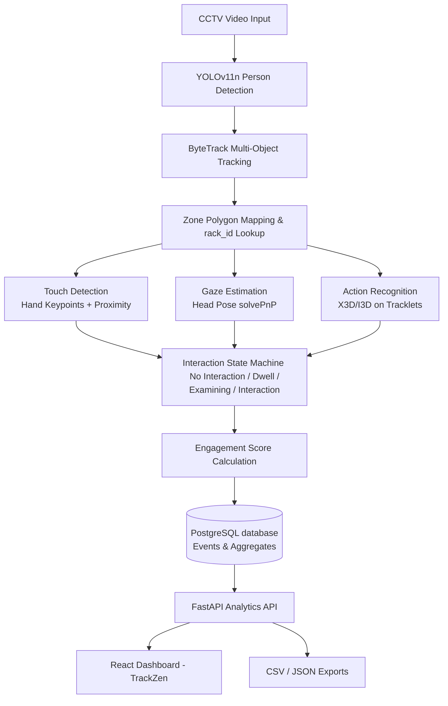

TrackZen — AI-Powered Retail Shelf Engagement Analytics

Computer vision system that turns raw retail CCTV footage into structured shelf-engagement intelligence — who visited which shelf, what they did there, and whether it converted.

## Table of Contents

- [Problem Statement](#problem-statement)
- [Solution Overview](#solution-overview)
- [Tech Stack](#tech-stack)
- [System Architecture](#system-architecture)
- [Project Structure](#project-structure)
- [Models](#models)
- [Database Schema](#database-schema)
- [API Endpoints](#api-endpoints)
- [Data Pipeline & Output Schema](#data-pipeline--output-schema)
- [Dashboard Features](#dashboard-features)
- [System Requirements](#system-requirements)
- [Setup & Installation](#setup-installation)
- [Limitations & Honest Constraints](#limitations--honest-constraints)
- [Future Work](#future-work)

## Problem Statement

Retailers need to understand how customers interact with shelves and products to optimize layout, placement, and the overall shopping experience. Manual observation doesn't scale, and dedicated sensor hardware is expensive. Existing CCTV infrastructure, paired with computer vision, offers a scalable path to the same insight — without new hardware investment.

Challenge: Build a CV system that analyzes in-store surveillance footage to detect and track customers, identify shelf interactions, and generate analytics — dwell time, shelf popularity, and engagement quality — surfaced through a live dashboard.

## Solution Overview

TrackZen ingests video from a store's existing CCTV camera and produces a structured, per-visitor, per-shelf engagement record through four stages:

- **Detect & Track** — locate every customer in frame and assign a persistent unique ID as they move through the store.
- **Classify Behavior** — beyond just "present near a shelf," classify what the customer is doing: turning toward a shelf, touching a product, picking an item up and keeping it, or picking it up and returning it.
- **Score Engagement** — combine dwell time, action type, touch events, and revisit frequency into a single interpretable Engagement Score per shelf visit — the project's core original contribution, going beyond raw "time spent" metrics used in most prior CV retail-analytics work.
- **Surface Insight** — a live dashboard (TrackZen) shows per-shelf visitor counts, dwell time, conversion-vs-attention breakdown, promotional lift, heatmaps, and peak engagement periods.

All metrics are explicitly framed as prototype/experimental outputs derived from a small labeled dataset, not production-scale validated figures — see [Limitations & Honest Constraints](#limitations--honest-constraints).

## Tech Stack

| Layer | Technology | Notes |
| :--- | :--- | :--- |
| Object Detection | YOLOv11n (Ultralytics) | Pretrained on COCO, person class only, no fine-tuning required for detection |
| Multi-Object Tracking | ByteTrack (built into Ultralytics) | Persistent track IDs; BoT-SORT as fallback for occlusion-heavy scenes |
| Pose / Hand Landmarks | YOLO11-pose / MediaPipe Hands | Wrist/hand keypoints for touch-event detection |
| Face Landmarks / Head Pose | MediaPipe Face Mesh + OpenCV solvePnP | Yaw/pitch/roll estimation for gaze-direction proxy |
| Action Recognition | X3D-S / I3D (pretrained on Kinetics-400, pytorchvideo) | Transfer learning, frozen backbone + fine-tuned classifier head |
| Backend / API | FastAPI | Serves analytics endpoints to the dashboard |
| Database | PostgreSQL | Stores shelf/rack hierarchy, tracked events, session aggregates |
| Frontend | React (Vite) + Tailwind CSS + Recharts | Dashboard UI, charts, live camera overlay |
| Desktop Wrapper (optional) | Electron | For local file/hardware access as a standalone app |
| Containerization | Docker / Docker Compose | Deployable service boundaries (CV pipeline, API, DB, frontend) |
| Model Export (production path) | ONNX Runtime / TensorRT | For edge/real-time deployment |
| Edge Hardware (production path) | NVIDIA Jetson Orin Nano | Real-time inference target for in-store deployment |

## System Architecture



Design principle: detection and tracking run once per frame; every downstream module (zones, touch, gaze, action recognition, state machine, scoring) consumes tracked person data rather than re-running detection — keeping the pipeline modular and each stage independently testable.

## Project Structure

```
TrackZen/
├── backend/
│   ├── app/                          # FastAPI core application
│   │   ├── api/v1/                   # REST API routes (analytics overview/sessions)
│   │   ├── core/                     # config settings
│   │   ├── db/                       # SQLAlchemy sessions
│   │   └── models/                   # DB model definitions
│   ├── models/                       # YOLO models & test clips
│   ├── outputs/                      # annotated output video & state JSON exports
│   ├── scratch/                      # wrist keypoint & gaze test scripts
│   ├── tracking_pipeline.py          # YOLOv11 + ByteTrack pipeline
│   ├── touch_detection.py            # wrist keypoint proximity touch engine
│   ├── gaze_estimation.py            # solvePnP head orientation direction proxy
│   ├── state_machine.py              # ShopperStateMachine with transition logic
│   ├── analytics_engine.py           # cumulative session aggregates & metrics
│   ├── test_pipeline.py              # validation test runner
│   └── trackzen.db                   # SQLite store
│
├── frontend/
│   ├── src/
│   │   ├── components/               # DataContext.jsx, Sidebar.jsx, TopNav.jsx
│   │   ├── views/                    # DashboardView, AnalyticsView, NvrView, HeatmapView
│   │   ├── App.jsx                   # React Router configurations
│   │   └── main.jsx                  # React entry point
│   ├── public/                       # static assets (blueprint.jpeg, picking_and_returning_tracked.mp4)
│   ├── package.json                  # React dependencies list
│   └── vite.config.js                # Vite build options
├── .start.sh                         # script to stop/start backend & frontend uvicorn/vite servers
└── README.md
```

## Models

| Model | Purpose | Source / Weights | Training Approach |
| :--- | :--- | :--- | :--- |
| YOLOv11n | Person detection | Pretrained (COCO) via Ultralytics | No fine-tuning |
| YOLO11-pose / MediaPipe Hands | Hand/wrist keypoints for touch detection | Pretrained | No fine-tuning |
| MediaPipe Face Mesh | Facial landmarks for head-pose/gaze estimation | Pretrained | No fine-tuning |
| X3D-S (primary) or I3D (alternative) | Action classification: Turning to Shelf / Touching / Picking & Putting / Picking & Returning | Pretrained on Kinetics-400 | Transfer learning — backbone frozen, classifier head fine-tuned on the 40-clip labeled dataset with heavy augmentation (temporal jitter, flip, crop) |
| ByteTrack | Multi-object tracking | Algorithmic (Kalman filter + Hungarian assignment), not a trained network | N/A |

Dataset used for action recognition fine-tuning: "Hafidz 2 Store" — 40 pre-labeled clips (10 each: Turning to Shelf, Touching, Picking and Putting, Picking and Returning). Given the small sample size, results are validated via qualitative spot-checks and small-sample cross-validation, not large-scale benchmark accuracy — stated explicitly to avoid overclaiming.

## Database Schema

Core entities: stores → shelves → racks, with event tables referencing rack_id directly.

```sql
stores(store_id, store_name, location)
shelves(shelf_id, store_id, shelf_name, shelf_type)
racks(rack_id, shelf_id, rack_number, category_desc, zone_polygon)
product_categories(category_id, category_name)
rack_categories(rack_id, category_id)                 -- many-to-many

zone_interactions(interaction_id, track_id, rack_id, video_filename,
                   entry_ts_sec, exit_ts_sec, dwell_sec)
touch_events(touch_id, track_id, rack_id, hand_used, start_ts_sec, end_ts_sec)
action_events(action_id, track_id, rack_id, action_class, start_ts_sec, end_ts_sec, confidence)
```

Current store layout modeled: Left Wall (8 racks), Middle Left Aisle (5 racks), Back Wall (5 racks), Center Island Display (2 racks), Right Wall / Wire Racks (5 racks) — 25 racks total, each with a rack_id (e.g. LW_R1, BW_R3) shared identically between the database and the CV pipeline's zone-polygon config, so detection events write directly into these tables with no ID-translation layer.

## API Endpoints

| Method | Endpoint | Description |
| :--- | :--- | :--- |
| GET | `/api/shelves` | List all shelves and racks with metadata |
| GET | `/api/shelves/{rack_id}/stats` | Per-rack aggregate stats: visits, avg dwell, conversion ratio |
| GET | `/api/engagement/summary` | Store-wide engagement summary (top/bottom shelves, overall score) |
| GET | `/api/engagement/peak-periods` | Hourly engagement time-series (for Peak Engagement Periods chart) |
| GET | `/api/engagement/{track_id}` | Full session record for one tracked visitor |
| GET | `/api/heatmap` | Aggregated floor-plane density points for heatmap rendering |
| GET | `/api/live/feed` | Live/annotated camera feed stream (with bounding boxes, state overlay) |
| GET | `/api/live/state/{track_id}` | Current interaction state + timer for one active track |
| GET | `/api/promotions` | Promo-flagged shelves and lift metrics (dwell/conversion vs. non-promo) |
| GET | `/api/reports/export` | Trigger/download full CSV export (`analytics_master.csv`) |
| POST | `/api/zones` | Create/update a shelf/rack zone polygon (admin/calibration use) |

All endpoints return data already computed by the CV pipeline and stored in PostgreSQL — the API layer does not run inference itself; it serves pre-computed analytics.

## Data Pipeline & Output Schema

Every tracked visit produces one row per (unique_id, rack_id) pair in the master CSV:

```
unique_id, rack_id, promo_active, first_seen_frame, last_seen_frame,
entry_timestamp_sec, exit_timestamp_sec, dwell_duration_sec, total_dwell_sec,
visit_count, touch_count, pickup_count, interaction_duration_sec, hand_used,
dominant_action, attention_only_flag, converted_flag, rejected_flag,
engagement_score, track_confidence, video_filename
```

Conversion Insights are computed as a behavioral proxy (pickup-without-return), not verified point-of-sale data:

- **attention_only** — dwell/gaze at a shelf, no pickup action
- **converted** — "Picking and Putting" action, item kept
- **rejected** — "Picking and Returning" action, item returned

Engagement Score formula:

$$EngagementScore = w1\cdot(action\_weight) + w2\cdot(normalized\_dwell\_time) + w3\cdot(revisit\_count) + w4\cdot(touch\_score)$$

where action_weight maps behavior to an ordinal intent scale (Turning=1, Touching=2, Picking & Returning=2.5, Picking & Putting=4) — the project's core original mathematical contribution, justified in the accompanying research report.

## Dashboard Features

- **Overview** — store-level snapshot: high-engagement flags, action-required alerts, date filter
- **Live Camera Feed** — annotated stream with bounding boxes, track ID, current interaction state + timer label above each box, color-coded by state (gray/blue/yellow/green)
- **Peak Engagement Periods** — hourly engagement time-series with real data points and tooltips
- **Shelf Popularity Comparison** — visits, share %, engagement level per shelf, with inline bars
- **Traffic Heatmap** — floor-plan overlay of accumulated foot-traffic density
- **Engagement (page)** — deep-dive per-shelf and per-visitor engagement breakdown
- **Inventory (page)** — rack/category reference view
- **Staffing (page)** — peak-period-informed staffing suggestions
- **Export Report** — one-click CSV/PDF export of current analytics view

## System Requirements

| Deployment mode | Hardware | Expected performance (1080p) |
| :--- | :--- | :--- |
| Prototype/dev | Any GPU (RTX 3050+) or CPU-only | YOLOv11n: 60-100+ FPS (GPU), ~8-15 FPS (CPU) |
| Edge production | NVIDIA Jetson Orin Nano + TensorRT export | ~30 FPS |
| Cloud/server production | GPU inference server (T4/A10+) | Scales with concurrent camera streams |

RAM: 8GB minimum / 16GB recommended. SSD recommended for video file I/O.

## Setup & Installation

```bash
# CV pipeline
pip install ultralytics mediapipe pytorchvideo opencv-python --break-system-packages

# Backend
cd api && pip install -r requirements.txt
uvicorn main:app --reload

# Frontend
cd dashboard && npm install && npm run dev

# Full stack via Docker
docker-compose up --build
```

## Limitations & Honest Constraints

- **Camera constraint**: source camera is auto-rotating (~180°, ~120° effective coverage) and motion-triggered — not a fixed continuous feed. Dwell time is therefore a lower-bound estimate bounded by observed clip duration, not guaranteed total time-in-store. Current implementation assumes single-orientation calibration; multi-orientation zone remapping is needed for full production deployment.
- **Small training sample**: action recognition is fine-tuned on only 40 labeled clips (10 per class). This is a prototype-stage classifier using transfer learning — production deployment requires a substantially larger labeled dataset.
- **Gaze estimation** is head-orientation-based, not true eye-tracking — a legitimate industry proxy, but explicitly not equivalent to verified visual attention.
- **Conversion metrics** are behavioral proxies (pickup-without-return), not verified point-of-sale transaction data.
- **ByteTrack** does not perform long-term re-identification — a visitor who leaves and re-enters frame is counted as a new track ID unless BoT-SORT/appearance-based re-ID is enabled.
- **Domain gap**: pretrained COCO/Kinetics weights are trained largely on eye-level, non-fisheye imagery; overhead CCTV angle and lens distortion introduce accuracy risk not reflected in public benchmark numbers.

## Future Work

- Multi-camera stitching and cross-camera track re-identification
- Larger labeled dataset for action recognition fine-tuning
- ONNX/TensorRT export and edge deployment benchmarking on Jetson Orin Nano
- Point-of-sale data integration to validate the conversion-proxy metric against real sales
- Multi-orientation zone calibration for rotating-camera deployments
- Electron desktop packaging for store-manager-facing standalone app